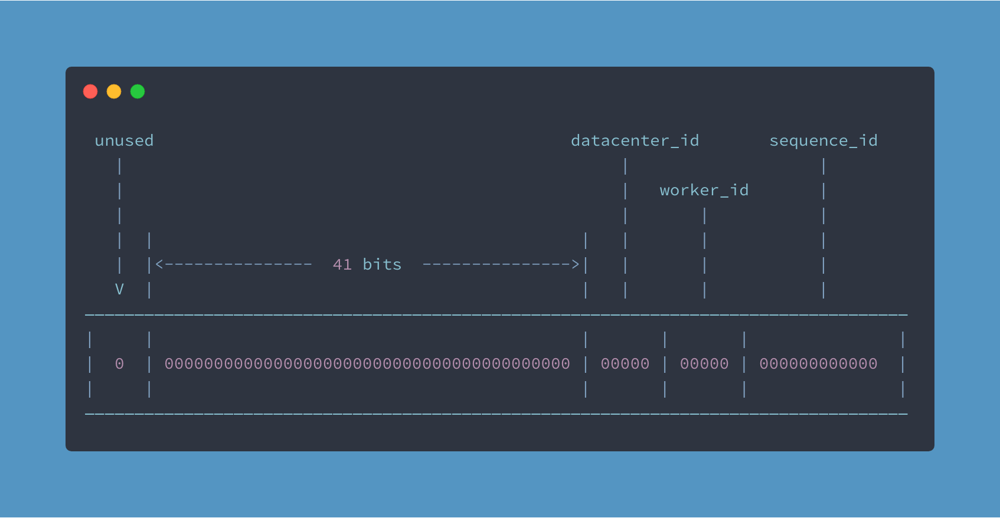

# YII2 Snowflake 雪花算法ID生成器


雪花算法ID生成器 (Yii2 组件)

[](https://packagist.org/packages/bestyii/yii2-snowflake)
[](https://packagist.org/packages/bestyii/yii2-snowflake)
[](https://packagist.org/packages/bestyii/yii2-snowflake)

## 环境要求

PHP >= 7.0

## 安装

安装此扩展的首选方法是：[composer](http://getcomposer.org/download/).

项目根目录下运行

```
php composer.phar require --prefer-dist bestyii/yii2-snowflake "*"
```

或添加到`composer.json`文件的require区域中.

```
"bestyii/yii2-snowflake": "*"
```


### 配置

#### 快速上手

在配置文件中加入

```php
return [
    //...
    'components' => [
        //...
        'snowflake' => [
            'class' => 'bestyii\snowflake\Snowflake',
            'startDate' => '2022-12-31',
        ],
    ],
];
```

|  参数   | 说明  |
|  ----  | ----  |
| startDate  | 起始日期 , 字符串`Y-m-d`格式, 如: '2022-12-31'|

#### 高级配置

雪花算法生成的 ID 并不能保证唯一，如当两个不同请求同一时刻进入相同的数据中心的相同节点时，而此时该节点生成的 sequence 又是相同时，就会导致生成的 ID 重复。 所以要想使用雪花算法生成唯一的
ID，就需要保证同一节点同一毫秒内生成的序列号是唯一的。

此扩展内置了基于redis的序列号生成器`\bestyii\snowflake\RedisSequenceResolver`,保证同一毫秒生成的序列号不同。

```php
return [
    //...
    'components' => [
        //...
        'snowflake' => [
            'class' => 'bestyii\snowflake\Snowflake',
            'startDate' => '1970-1-1',
            'datacenterId' => 11,
            'workerId' => 22,
            'sequencer' =>  '\bestyii\snowflake\RedisSequenceResolver', 
        ],
    ],
];
```

|  参数   | 说明  |
|  ----  | ----  |
| startDate  | 起始日期 |
| datacenterId  | 数据中心id |
| workerId  | 主机id |
| sequencer  | `\bestyii\snowflake\RedisSequenceResolver`, 需要配置 [yii2-redis](https://github.com/yiisoft/yii2-redis) 组件 |

## 如何使用

### 手动

生成id

```php
$id = \Yii::$app->snowflake->id();
// 401621641244704768
```

解析id

```php
\Yii::$app->snowflake->parseId($id);
//[
//    'timestamp' => '1011001001011011000110000010011110010'
//    'sequence' => '000000000000'
//    'workerid' => '00000'
//    'datacenter' => '00000'
//]
```

### 使用Behavior自动生成id

本组件支持通过附加ActiveRecord Model的behavior方式来完成自动生成id

使用下列语法:

```php
public function behaviors()
{
    return [
        'snowflake' => [
            'class' => '\bestyii\snowflake\SnowflakeBehavior',
            'attributes' => 'id',// default:id
        ],
    ];
}
```

在数据保存之前, 该behavior(行为)会自动生成id.

## 雪花算法说明

本项目基于 [godruoyi/php-snowflake](https://github.com/godruoyi/php-snowflake) 实现.



Snowflake 是 Twitter 内部的一个 ID 生算法，可以通过一些简单的规则保证在大规模分布式情况下生成唯一的 ID 号码。其组成为：

- 第一个 bit 为未使用的符号位。
- 第二部分由 41 位的时间戳（毫秒）构成，他的取值是当前时间相对于某一时间的偏移量。
- 第三部分和第四部分的 5 个 bit 位表示数据中心和机器ID，其能表示的最大值为 2^5 -1 = 31。
- 最后部分由 12 个 bit 组成，其表示每个工作节点每毫秒生成的序列号 ID，同一毫秒内最多可生成 2^12 -1 即 4095 个 ID。

需要注意的是：

- 在分布式环境中，5 个 bit 位的 datacenter 和 worker 表示最多能部署 31 个数据中心，每个数据中心最多可部署 31 台节点 -41 位的二进制长度最多能表示 2^41 -1 毫秒即 69
  年，所以雪花算法最多能正常使用 69 年，为了能最大限度的使用该算法，你应该为其指定一个开始时间。